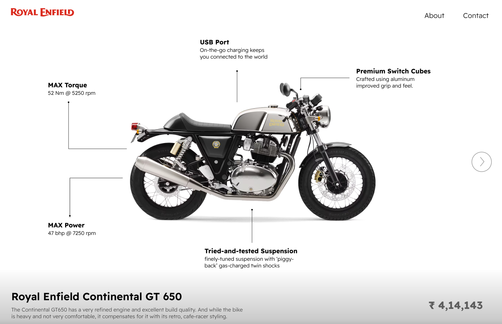

# RE650-UI
This repository contains the UI design for showcasing Royal Enfield's 650cc bike lineup. The design highlights bike models, specifications, and features in a clean, modern layout. Created in Figma, the interface aims to provide an immersive user experience for exploring bike details and comparisons.

Key Features:

Visual representation of Royal Enfield 650cc models, 

Bike specifications and detailed views, 

Responsive and intuitive layout, 

Sleek design for a premium feel 

  

This is the UI design for Royal Enfield's 650cc bike lineup, showcasing models, features, and details.  
